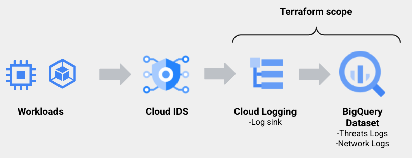

# Cloud IDS Log export to BQ
Terraform deployment for Cloud Routers log sink and Bigquery dataset for Cloud IDS logs

Cloud IDS endpoint is not provisionned via this terraform. You need to take care of this part, manually via the UI or via GCloud command.

This code is not ment to be used in a production environment!
Please review before usage.

## Provision infrastructure
```
terraform init
terraform plan
terraform apply -auto-approve
```

## Actions taken by terraform
```
Creating a Bigquery Dataset
Creating a Cloud Router log sink to Bigquery
Provision writer_identity IAM access to Bigquery to write logs
```
### Filter
Default active filters, feel free to modify those filters to reflect your needs.
ids.googleapis.com%2Fthreat
ids.googleapis.com%2Ftraffic

### Scope
